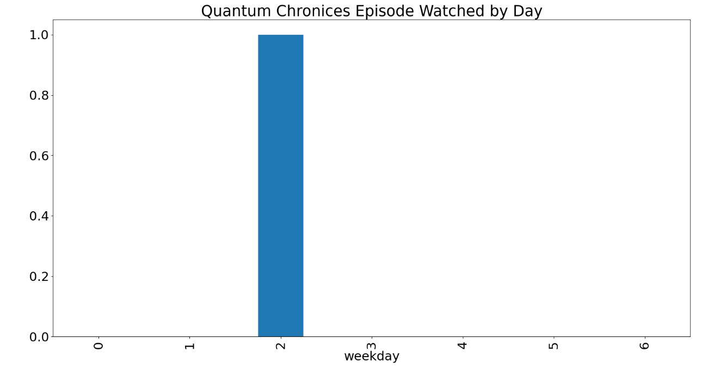

# Netflix-Series-Habit-Analyzer-Project
The "Netflix Series Habit Analyzer" offers insights into our binge-watching habits, helping to manage personal screen time and understand personal series-watching behavior and helpful to analyze the watching behavior of an individual.
## For this:

Install the **requirement.txt** file from the repo **** Then the python script as  [netflix data analysis.py](https://github.com/shashangka-upadhyaya/Netflix-Series-Habit-Analyzer-Project/blob/main/netflix%20data%20analysis.py)

### Results
**1.First we read our data from our csv file which is present in our local directory it contains our netflix series watching data.

**2. in depth analysis is done from this data set using Phyton pandas thses are our watching habits.

